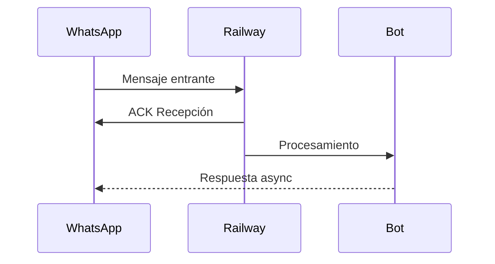
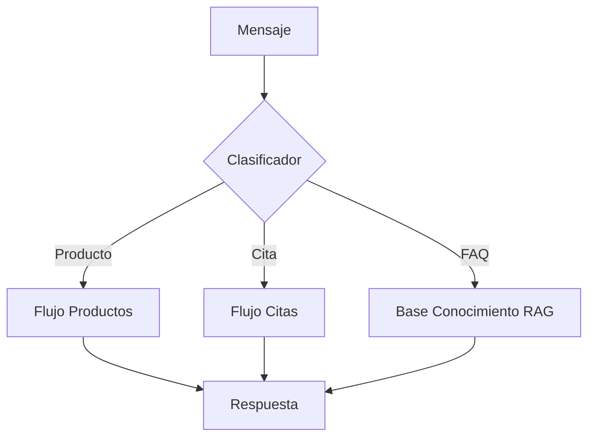

## Getting Started

With this library, you can build automated conversation flows agnostic to the WhatsApp provider, set up automated responses for frequently asked questions, receive and respond to messages automatically, and track interactions with customers. Additionally, you can easily set up triggers to expand functionalities limitlessly.

```
npm create builderbot@latest
```


## Descripción del Sistema
**Bot de WhatsApp para Gestión Inteligente**

### Funcionalidades Clave
1. **Clasificación Automática de Mensajes**
   - Detección de intenciones (consultas de productos, citas, FAQs)
   - Análisis de sentimiento y urgencia
   - Enrutamiento a flujos específicos

2. **Gestión de Citas Automatizada**
   - Integración con Google Calendar
   - Sistema de recordatorios proactivos
   - Actualización en tiempo real en Google Sheets

3. **Sistema RAG (Retrieval-Augmented Generation)**
   - Base de conocimiento vectorizado
   - Respuestas contextuales usando embeddings

4. **Arquitectura Modular**
```
Core Bot → [Clasificador] → [Flujos]
           ↓         ↖       ↓
   [Servicios AI]  [RAG]  [Integraciones Google]
```

### Puntos de Mejora Identificados
1. **Patrones de Inyección de Dependencias**
   - Current: Acoplamiento directo en constructores
   - Optimización: Implementar contenedor DI

2. **Manejo de Errores Centralizado**
   - Current: Try/catch dispersos
   - Propuesta: Middleware global de errores

3. **Gestión de Configuración**
   - Current: Variables de entorno directas
   - Mejora: Servicio config con validación schema

4. **Optimización RAG**
   - Current: Cálculo similitud en memoria
   - Recomendación: Usar vectorDB (Redis/Chroma)

5. **Patrones de Cache**
   - Oportunidad: Cache LRU para consultas frecuentes

6. **Monitoreo**
   - Necesidad: Métricas OpenTelemetry
   - Beneficio: Trazabilidad completa

## 🚀 Deployment en Railway
### Configuración Esencial
1. **Variables de Entorno**:
```bash
WHATSAPP_PROVIDER=baileys
GOOGLE_CLIENT_EMAIL=${{RAILWAY_GOOGLE_CLIENT_EMAIL}}
GOOGLE_PRIVATE_KEY=${{RAILWAY_GOOGLE_PRIVATE_KEY}}
WHATSAPP_SESSION=railway
```

2. **Build Commands**:
```bash
npm install --omit=dev
npm run build
```

3. **Webhooks**:


### Consideraciones Clave WhatsApp
1. **Timeout Handling**:
   - Configurar `WHATSAPP_TIMEOUT=45000` (45s)
   - Implementar reintentos con backoff exponencial

2. **Gestión de Sesiones**:
   - Usar `REDIS_URL` para almacenar sesiones
   ```ts
   provider: createProvider('baileys', {
     sessionStore: new RedisStore(process.env.REDIS_URL)
   })
   ```

3. **Optimización para Serverless**:
   - Pool de conexiones Google APIs
   - Warmup endpoint (`GET /_health`)

### Puntos de Mejora (Actualizados)
1. **Patrones de Inyección de Dependencias**
   - Current: Acoplamiento directo en constructores
   - Optimización: Implementar contenedor DI

2. **Manejo de Errores Centralizado**
   - Current: Try/catch dispersos
   - Propuesta: Middleware global de errores

3. **Gestión de Configuración**
   - Current: Variables de entorno directas
   - Mejora: Servicio config con validación schema

4. **Optimización RAG**
   - Current: Cálculo similitud en memoria
   - Recomendación: Usar vectorDB (Redis/Chroma)

5. **Patrones de Cache**
   - Oportunidad: Cache LRU para consultas frecuentes

6. **Monitoreo**
   - Necesidad: Métricas OpenTelemetry
   - Beneficio: Trazabilidad completa

7. **Serverless Optimization**:
   - Current: Estado en memoria
   - Recomendación: Redis para sesiones y cache
   - Beneficio Railway: Mejor escalado horizontal

8. **Manejo de Archivos**:
   - Usar S3/MinIO para multimedia
   ```ts
   // railway.json
   {
     "persist": {
       "media": "s3://my-bucket"
     }
   }
   ```



## Documentation

Visit [builderbot](https://builderbot.vercel.app/) to view the full documentation.


## Official Course

If you want to discover all the functions and features offered by the library you can take the course.
[View Course](https://app.codigoencasa.com/courses/builderbot?refCode=LEIFER)


## Contact Us
- [💻 Discord](https://link.codigoencasa.com/DISCORD)
- [👌 𝕏 (Twitter)](https://twitter.com/leifermendez)