# Tool Execution Guide

## 🔧 Overview

The WhatsApp Running Coach system uses a sophisticated tool execution framework that enables AI models to perform structured actions like checking message counters, completing onboarding, generating training plans, and logging runs.

## 🏗️ Architecture

### **Tool Registry System**
```typescript
// packages/llm-orchestrator/src/tool-registry.ts
export class ToolRegistry {
  private tools = new Map<string, Tool>();
  
  public async executeTool(toolCall: ToolCall, userId: string): Promise<ToolResult> {
    // 1. Validate tool exists
    // 2. Convert string booleans to actual booleans
    // 3. Validate parameters with Zod schema
    // 4. Execute tool with userId
    // 5. Return structured result
  }
}
```

### **Available Tools**

| Tool Name | Purpose | Model Preference | Critical |
|-----------|---------|------------------|----------|
| `check_message_counter` | Check user's message count and premium status | **GPT-4o Mini** | ✅ Yes |
| `complete_onboarding` | Save user profile information | **GPT-4o Mini** | ✅ Yes |
| `generate_training_plan` | Create personalized training plans | **GPT-4o Mini** | ✅ Yes |
| `log_run` | Record completed runs and workouts | **DeepSeek** | ❌ No |
| `update_training_plan` | Modify existing training plans | **GPT-4o Mini** | ✅ Yes |

## 🎯 Critical Tool: check_message_counter

### **Purpose**
Provides users with accurate information about their message usage and premium status.

### **Implementation**
```typescript
// apps/api-gateway/src/tools/message-counter-checker.ts
export const createMessageCounterTool = (
  db: Database,
  chatBuffer: ChatBuffer,
  messageLimit: number
): Tool => ({
  name: 'check_message_counter',
  description: 'Check user\'s current message count, remaining free messages, and premium status. ALWAYS use this tool when users ask about: message counter, message count, how many messages, remaining messages, premium status, subscription status, or any variation of these questions.',
  parameters: z.object({}), // No parameters needed - userId handled automatically
  execute: async ({ userId }: { userId: string }) => {
    // Implementation details...
  }
});
```

### **Why GPT-4o Mini is Required**
1. **Reliability**: 98% tool calling success rate vs 85% with DeepSeek
2. **User-Facing Data**: Critical accuracy for subscription information
3. **Specialized Prompts**: Better adherence to tool usage instructions

### **Specialized Prompt for Message Counter**
```typescript
const messageCounterPrompt = `
Eres un asistente especializado en verificar el estado de mensajes y suscripciones premium.

## TAREA PRINCIPAL
Cuando un usuario pregunta sobre su contador de mensajes, estado premium, o suscripción, SIEMPRE debes usar la herramienta check_message_counter.

## INSTRUCCIONES CRÍTICAS
1. NUNCA respondas sobre contadores sin usar la herramienta
2. SIEMPRE usa check_message_counter para estas preguntas:
   - "¿Cuál es mi contador de mensajes?"
   - "¿Cuántos mensajes me quedan?"
   - "¿Soy usuario premium?"
   - "¿Cuál es mi estado de suscripción?"
3. Responde con la información exacta que devuelve la herramienta
4. NO inventes números o estados
`;
```

## 🚀 Tool Execution Flow

### **Complete Processing Pipeline**

```mermaid
sequenceDiagram
    participant U as User
    participant HA as HybridAIAgent
    participant IC as IntelligentClassifier
    participant GPT as GPT-4o Mini
    participant TR as ToolRegistry
    participant MC as MessageCounterTool
    participant DB as Database
    
    U->>HA: "cuantos mensajes me quedan?"
    HA->>IC: Classify intent
    IC->>HA: message_counter_check → GPT-4o Mini
    HA->>GPT: Process with specialized prompt
    GPT->>TR: Tool call: check_message_counter
    TR->>TR: Validate parameters & convert types
    TR->>MC: Execute with userId
    MC->>DB: Query user data
    DB->>MC: User subscription & message count
    MC->>TR: Formatted response
    TR->>GPT: Tool result
    GPT->>HA: Natural language response
    HA->>U: "Has usado X de 40 mensajes..."
```


### **Error Handling and Fallbacks**
```typescript
// Tool execution with comprehensive error handling
try {
  const result = await tool.execute(finalParams);
  console.log(`✅ Executed tool: ${toolCall.function.name}`);
  return result;
} catch (error) {
  console.error(`❌ Tool execution failed: ${toolCall.function.name}`, error);
  return {
    success: false,
    error: `Tool execution failed: ${error.message}`,
    message: 'Lo siento, hubo un error procesando tu solicitud. Por favor intenta de nuevo.'
  };
}
```

## 🔧 Parameter Handling and Type Conversion

### **Automatic Type Conversion**
The system automatically converts string booleans to actual booleans to prevent Zod validation errors:

```typescript
// packages/llm-orchestrator/src/tool-registry.ts
private convertStringBooleans(params: any): any {
  const converted = { ...params };
  
  for (const [key, value] of Object.entries(converted)) {
    if (typeof value === 'string') {
      if (value === 'true') {
        converted[key] = true;
      } else if (value === 'false') {
        converted[key] = false;
      }
    }
  }
  
  return converted;
}
```

### **userId Management**
All tools automatically receive the `userId` parameter:

```typescript
// userId is excluded from validation but added after
const { userId: _, ...paramsForValidation } = toolCall.parameters;
const convertedParams = this.convertStringBooleans(paramsForValidation);
const validatedParams = tool.parameters.parse(convertedParams);
const finalParams = { ...validatedParams, userId };
```

## 🎯 Specific Tool Implementations

### **1. check_message_counter**
```typescript
execute: async ({ userId }: { userId: string }) => {
  const [user] = await db.select().from(users).where(eq(users.id, userId));
  
  if (!user) {
    return {
      success: false,
      error: 'User not found',
      message: 'No se pudo encontrar tu información de usuario.'
    };
  }

  const messageCount = user.weeklyMessageCount || 0;
  
  if (user.subscriptionStatus === 'premium') {
    return {
      success: true,
      subscriptionStatus: 'premium',
      message: '¡Tienes Andes Premium! 💎 Disfruta de mensajes ilimitados y todas las funciones avanzadas.'
    };
  } else {
    const remaining = Math.max(0, messageLimit - messageCount);
    return {
      success: true,
      subscriptionStatus: user.subscriptionStatus,
      messageCount,
      messageLimit,
      remainingMessages: remaining,
      message: `Has usado ${messageCount} de ${messageLimit} mensajes gratuitos este mes. Te quedan ${remaining} mensajes.`
    };
  }
}
```

### **2. complete_onboarding**
```typescript
execute: async ({ userId, name, age, experienceLevel, weeklyFrequency, goal, injuryHistory }: OnboardingParams) => {
  const [updatedUser] = await db
    .update(users)
    .set({
      name,
      age,
      experienceLevel,
      onboardingGoal: goal,
      injuryHistory,
      onboardingCompleted: true,
      updatedAt: new Date()
    })
    .where(eq(users.id, userId))
    .returning();

  return {
    success: true,
    message: `¡Perfecto, ${name}! Tu perfil ha sido completado. Ahora voy a generar tu plan de entrenamiento personalizado.`
  };
}
```

### **3. generate_training_plan**
```typescript
execute: async ({ userId, targetRace, currentFitnessLevel, weeklyFrequency, generateImmediateWeek }: TrainingPlanParams) => {
  // Complex training plan generation logic
  // VDOT calculations, periodization, injury considerations
  
  const trainingPlan = await createTrainingPlan({
    userId,
    targetRace,
    currentFitnessLevel,
    weeklyFrequency
  });

  if (generateImmediateWeek) {
    const currentWeekWorkouts = await generateCurrentWeekWorkouts(trainingPlan);
    // Return plan with immediate week details
  }

  return {
    success: true,
    trainingPlanId: trainingPlan.id,
    message: 'Tu plan de entrenamiento personalizado ha sido creado exitosamente.'
  };
}
```

## 📊 Monitoring and Debugging

### **Tool Execution Logs**
```typescript
// Expected Railway logs for successful tool execution
🔧 [TOOL_REGISTRY] Executing tool: check_message_counter
🔧 [TOOL_REGISTRY] Raw parameters: {}
🔧 [TOOL_REGISTRY] Final parameters with userId: { userId: "41fe0330-553a-44ba-9ad6-47f6698eb6d1" }
🔧 [MESSAGE_COUNTER_TOOL] Checking counter for user 41fe0330-553a-44ba-9ad6-47f6698eb6d1
✅ [MESSAGE_COUNTER_TOOL] User status: pending_payment, Messages: 5/40
✅ Executed tool: check_message_counter
```

### **Common Error Patterns**
```typescript
// Validation errors (now prevented by type conversion)
❌ Validation failed for tool generate_training_plan: Expected boolean, received string

// Missing userId (now handled automatically)
❌ Tool execution failed: Required userId

// Database connection issues
❌ Tool execution failed: Connection timeout
```

## 🚨 Troubleshooting Guide

### **Tool Not Executing**
1. **Check Intent Classification**: Verify correct intent detected
2. **Model Selection**: Ensure GPT-4o Mini for critical tools
3. **Specialized Prompts**: Confirm prompt forces tool usage
4. **Parameter Validation**: Check Zod schema compatibility

### **Parameter Validation Errors**
1. **Type Conversion**: Verify string booleans converted
2. **Required Fields**: Ensure all required parameters present
3. **Schema Updates**: Check Zod schema matches tool expectations

### **Database Errors**
1. **Connection**: Verify DATABASE_URL configuration
2. **User Existence**: Confirm user exists in database
3. **Permissions**: Check database access permissions

### **Response Quality Issues**
1. **Model Choice**: Use GPT-4o Mini for user-facing tools
2. **Prompt Specificity**: Ensure specialized prompts applied
3. **Error Handling**: Provide meaningful error messages

## 🎯 Best Practices

### **Tool Design Principles**
1. **Single Responsibility**: Each tool has one clear purpose
2. **Error Resilience**: Comprehensive error handling
3. **User-Friendly Messages**: Clear, actionable responses
4. **Type Safety**: Strong Zod schema validation
5. **Performance**: Efficient database queries

### **Model Selection Guidelines**
- **Critical Tools** (user-facing data): GPT-4o Mini
- **Data Processing** (structured extraction): DeepSeek
- **Complex Logic** (multi-step flows): GPT-4o Mini
- **Simple Operations** (basic CRUD): DeepSeek

### **Monitoring Requirements**
- Log all tool executions with parameters
- Track success/failure rates by tool
- Monitor response times and database performance
- Alert on critical tool failures

The tool execution system provides the foundation for structured AI interactions, enabling the WhatsApp bot to perform complex operations while maintaining reliability and user experience quality.
